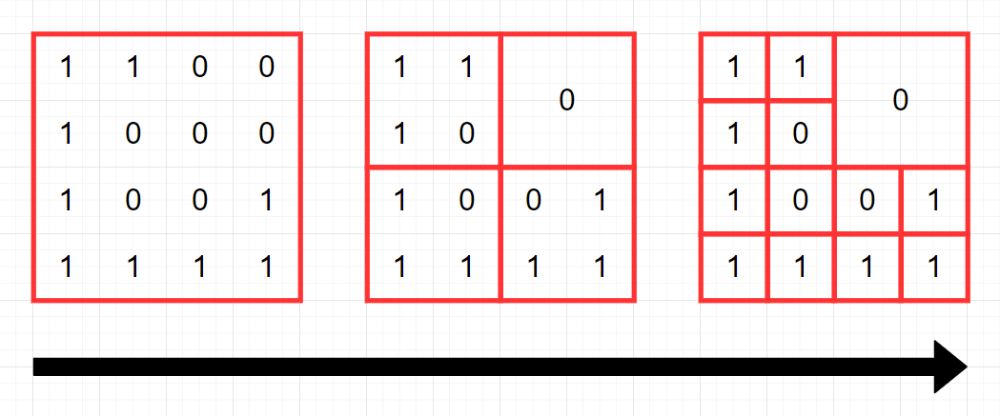

https://school.programmers.co.kr/learn/courses/30/lessons/68936

**쿼드압축 후 개수 세기**

**문제 설명**

0과 1로 이루어진 2n x 2n 크기의 2차원 정수 배열 arr이 있습니다. 당신은 이 arr을 쿼드 트리와 같은 방식으로 압축하고자 합니다. 구체적인 방식은 다음과 같습니다.

1. 당신이 압축하고자 하는 특정 영역을 S라고 정의합니다.
2. 만약 S 내부에 있는 모든 수가 같은 값이라면, S를 해당 수 하나로 압축시킵니다.
3. 그렇지 않다면, S를 정확히 4개의 균일한 정사각형 영역(입출력 예를 참고해주시기 바랍니다.)으로 쪼갠 뒤, 각 정사각형 영역에 대해 같은 방식의 압축을 시도합니다.

arr이 매개변수로 주어집니다. 위와 같은 방식으로 arr을 압축했을 때, 배열에 최종적으로 남는 0의 개수와 1의 개수를 배열에 담아서 return 하도록 solution 함수를 완성해주세요.

**제한사항**

- arr의 행의 개수는 1 이상 1024 이하이며, 2의 거듭 제곱수 형태를 하고 있습니다. 즉, arr의 행의 개수는 1, 2, 4, 8, ..., 1024 중 하나입니다.
  - arr의 각 행의 길이는 arr의 행의 개수와 같습니다. 즉, arr은 정사각형 배열입니다.
  - arr의 각 행에 있는 모든 값은 0 또는 1 입니다.

**입출력 예**

| arr                                                                                                                                               | 	result  |
|---------------------------------------------------------------------------------------------------------------------------------------------------|----------|
| [[1,1,0,0],[1,0,0,0],[1,0,0,1],[1,1,1,1]]                                                                                                         | 	[4,9]   |
| [[1,1,1,1,1,1,1,1],[0,1,1,1,1,1,1,1],[0,0,0,0,1,1,1,1],[0,1,0,0,1,1,1,1],[0,0,0,0,0,0,1,1],[0,0,0,0,0,0,0,1],[0,0,0,0,1,0,0,1],[0,0,0,0,1,1,1,1]] | 	[10,15] |

**입출력 예 설명**

입출력 예 #1

- 다음 그림은 주어진 arr을 압축하는 과정을 나타낸 것입니다.
- 
- 최종 압축 결과에 0이 4개, 1이 9개 있으므로, [4,9]를 return 해야 합니다.

입출력 예 #2

- 다음 그림은 주어진 arr을 압축하는 과정을 나타낸 것입니다.
- 
- 최종 압축 결과에 0이 10개, 1이 15개 있으므로, [10,15]를 return 해야 합니다.
